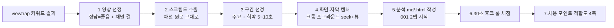

# 작업지침서 — 도입부 분석 & 키워드 기획 마스터 SOP

> **이 문서의 위상**: `20_research/competitors/도입부분석/` 안의 **모든 신규 자료는 이 지침을 그대로 적용**한다.
> 지금까지(2026-06-07) 수행한 전 과정을 표준으로 고정한 문서다. 충돌 시 이 문서가 우선한다.
> 세부 실행은 [`실행_플레이북.md`](실행_플레이북.md), 채점 기준은 [`_기준/30초_후크_룰_체크리스트.md`](_기준/30초_후크_룰_체크리스트.md), 빈 양식은 [`_TEMPLATE/`](_TEMPLATE/) 참조.

---

## 0. 한눈에 보기

| 구분 | 표준 |
|---|---|
| **목적** | 레퍼런스 유튜브 도입부를 해체→채점→차용해 우리 채널(그럼에도 불구하고) 후크·제목·썸네일 기획에 쓴다 |
| **입력** | viewtrap '썸끝' 키워드 결과의 레퍼런스 영상 |
| **산출물(영상 1편당)** | `transcript.md` + `분석.md` + `분석.html`(2탭) + `captures/` |
| **표준 서식** | [`001_내성적인건물주_몸값올리는독서법/분석.html`](001_내성적인건물주_몸값올리는독서법/분석.html) = **기준 디자인** |
| **대본 원칙** | 📜 원문 = 스크립트 패널 **원문 그대로**(오탈자 포함)·수정 안 함 / 📝 대본 타임라인 = **내용을 최대한 그대로 유지**, **오타와 말이 안 맞는(비문) 부분만 수정**(윤문·요약 금지). 의미 교정·해석은 요약·차용에서만 |
| **화면/자막 원칙** | 실제 시청 확인 = ✔, 미확인 = ◻ + 수동 캡처 가이드 |

---

## 1. 폴더 구조 표준

```
20_research/competitors/도입부분석/
├── 작업지침서.md              ← 본 문서 (마스터 SOP)
├── README.md                  ← 도입부 분석 SOP(개요)
├── 실행_플레이북.md            ← 웹도구 실행 절차
├── _기준/30초_후크_룰_체크리스트.md
├── _TEMPLATE/{분석.md, 분석.html, transcript.md, captures/}
├── 001_<채널>_<제목>/          ← 단일 영상 심층 분석(기준 샘플)
└── 키워드기획/
    ├── README.md              ← 키워드별 선정 인덱스
    └── <NN_키워드>/
        ├── README.md
        └── <NN_제목슬러그>/
            ├── 분석.md
            ├── 분석.html       ← 001 서식 2탭
            ├── transcript.md   ← 스크립트 원문 그대로
            └── captures/
                └── _수동캡처_가이드.md
```

**명명 규칙**: 폴더 `NN_제목슬러그`(공백→`_`, `\/:*?"<>|#` 제거, 40자 내). 캡처 `mmss-mmss_라벨.png`.

---

## 2. 전체 워크플로우



---

## 3. 단계별 표준

### 3-1. 영상 선정 (viewtrap '썸끝')
1. `viewtrap.com/thumbnail-master` 히스토리에서 키워드의 `확인하기`(= `/thumbnail-master/result/<id>`)를 연다.
2. 정렬 **'썸네일 좋은 순'** 기준, 각 영상의 **정답(도구 판정) = 좋음**만 1차 후보.
3. **우리 채널 결**(책·독서·자기계발, 성인 대상)에 맞는 제목만 채택. **제외**: 주식·육아/초등맘·종교·이벤트·편집모음 등 결 불일치.
4. 영상 ID/제목/게시일/썸네일 평가를 표로 정리(키워드 폴더 README).

### 3-2. 스크립트 추출 (먼저 스크립트부터)
- **방법**: 영상 페이지 → `스크립트 표시` 패널 열기 → `ytd-transcript-segment-renderer` DOM 수집(Claude in Chrome). **데이터/영상 다운로드 불필요** — 자막 텍스트만 뽑는다.
- **두 갈래로 사용**:
  - **📜 원문 탭** = 패널 **원문 그대로**(자동자막 오탈자 포함) 보존 · 절대 수정 안 함.
  - **📝 대본 타임라인** = 같은 스크립트의 **내용을 최대한 그대로 유지**하며 **오타와 '말이 안 맞는 부분'(자동자막 오인식으로 비문·뜻이 안 통하는 구간)만 최소 수정**한 버전(맥락·의미·말투는 원문 유지, 윤문·요약 금지).
- **예외 처리**:
  - 자막 **미제공** 영상 → 제목·구성 기반 분석 + "자막 미제공" 명시.
  - 패널이 **영어 자동번역만** 제공 → 영어 원문 그대로 + "영어 자동번역 제공" 명시.

### 3-3. 구간 선정
- **주요 구간**: 첫 컷·첫 발화·의미 전환(그런데/하지만/사실)·인물/화면 전환·숫자·키워드·도입부 마지막.
- **희박 구간(5~10초 샘플링)**: 발화 공백 5~15초→5초마다, 15초+→10초마다. (대사 고밀도면 미적용)

### 3-4. 화면·자막 캡처 ★(001과 동일하게 반드시 수행)
> 대본만으로는 화면을 알 수 없다. **각 구간 시점의 실제 화면을 보고** `화면/컷`·`번인 자막`을 채운다.
1. **크롬을 포그라운드로** 전환(computer-use `open_application`). 백그라운드(`document.hidden`)면 스크린샷이 멈춘다.
2. `video.currentTime` 으로 시점 이동 + `pause()`. (seek와 스크린샷은 **분리 호출**)
3. 스크린샷으로 화면을 **육안 확인** → `화면/컷`(TH/B-roll/카드…)·`번인 자막`(중앙하단 문구)·그래픽(예: "(예고)" 태그) 기록.
4. 확인한 구간은 **✔**, 못 본 구간은 **◻** 로 표기.
5. **이미지 파일 저장은 환경 제약으로 불가**(§5) → `captures/_수동캡처_가이드.md`에 시점별 `&t=` URL을 남겨 수동 저장(Win+Shift+S)으로 보완.

### 3-5. 분석.html — 표준 서식(001 기준) · **3탭 고정**
- **📊 분석 리포트**: ①요약+후크 점수 링 ②30초 룰 채점(막대) ③후크 구조 흐름 ④음성×화면×연출 타임라인(✔/◻·번인 자막) ⑤차용 포인트 ⑥채널 적합도 4축 ⑦환경 메모
- **📝 대본 타임라인**(핵심·원고 분석): 아래 **3단계**로 만든다 —
  1. **전체 대본의 내용을 최대한 그대로 유지**하며 **오타와 말이 안 맞는(비문) 부분만 최소 수정**한다(맥락·의미·말투는 원문 유지, 윤문·요약 금지). 전체 스크립트를 **누락 없이** 살린다.
  2. 보정한 전체 스크립트를 **맥락 단위로 큰 구분**으로 나눈다(예: 통념 제기 → 자기 고백 → 정의/비유 → 관점 전환).
  3. 각 구분(단위)마다 **대본(보정 스크립트 전문) / 화면 / 자막**으로 정리. **화면·자막은 유튜브 웹 스크린샷 기반 표현 내용**(못 보면 "캡처 대기").
  → 목적: 전체 대본을 놓치지 않고 맥락·내용 단위로 묶어, 도입부의 화면·자막까지 세세히 아는 **원고 분석**.
- **📜 원문**: 자막 패널 **원문 그대로**(시점+대본, 오탈자 보존) — 절대 수정 안 함. (보정본은 대본 타임라인 탭)
- 원칙: 원문은 보존 / 대본 타임라인은 "내용 최대한 유지·오타와 말이 안 맞는(비문) 부분만 수정 + 맥락 구분 + 화면·자막 설명".
- CSS·레이아웃·탭 동작은 [`001 분석.html`](001_내성적인건물주_몸값올리는독서법/분석.html)·[유시민 분석.html](키워드기획/01_독서의_가치/01_책을_안_읽으면_무식해지는_걸까_가치있는_행동일까_(유시민)/분석.html)을 **기준 샘플**로 동일하게 유지.
- **작업 방식(심플·로컬 최소화)** — 영상 1편씩:
  1. 자막 패널로 **스크립트 추출**(Claude in Chrome)
  2. **오타·비문만 최소 수정(내용 최대 유지) + 맥락 단위 구분**(보통 3~4단위)
  3. 각 단위 시점을 **Claude in Chrome로 캡처**(seek→pause→screenshot) → 화면/번인 자막을 텍스트로 기록(크롬 창이 보이는 상태여야 캡처됨)
  4. **001/유시민 파일을 복사·수정**해 HTML 1개 작성
  - ⚠️ 여러 파일을 한 번에 만드는 **일괄 생성 스크립트는 쓰지 않는다**(다른 모듈 import 시 기존 파일을 덮어쓰는 부작용 발생). 로컬 스크립트는 최소화.

### 3-6. 30초 후크 룰 채점
[`_기준/30초_후크_룰_체크리스트.md`](_기준/30초_후크_룰_체크리스트.md)의 **필수 5항목 × 20점 = /100** + 등급(A 80+/B 60+/C 40+/D). 근거(구간·발화)를 함께 적는다.

### 3-7. 차용 포인트 · 채널 적합도 4축
- **차용**: 연출·구성 차용 + 우리 채널용 제목 변형안 2개(+피할 것).
- **적합도 4축**: ①좋아하는 책 ②결 3그룹 ③8축 ④이북리더기·readtree. 2개+ 해당=결 맞음. ②가 금전/육아 등으로 어긋나면 △(각도 변환).

---

## 4. 콘텐츠 작성 규칙(요약)

| 항목 | 규칙 |
|---|---|
| **대본** | 📜 원문 = 스크립트 패널 **원문 그대로**(오탈자 포함)·절대 윤문 금지 / 📝 대본 타임라인 = **내용을 최대한 그대로 유지**하고 **오타와 말이 안 맞는(비문) 부분만 수정**(맥락·의미 유지, 윤문·요약 금지) |
| **화면/자막** | 실제 시청으로 확인(✔)하거나, 못 보면 ◻ + 수동 캡처 가이드 |
| **요약·차용** | 여기서만 의미 교정·해석. 우리 채널(그럼에도 불구하고) 결로 변형안 제시 |
| **출처** | 헤더에 원본 URL·채널·게시일·분석일 명시 |
| **저작권** | 내부 기획·학습 참고용. 캡처·스크립트 재배포 금지 |

---

## 5. 환경 제약 & 우회 (시연으로 검증됨)

| 제약 | 상태 | 우회 |
|---|---|---|
| 캔버스 `toDataURL`→base64 반환 | ❌ 차단 | 캡처 파일 자동 저장 포기 |
| 스크린샷 `save_to_disk` | ❌ 세션 미저장 | 동일 |
| sandbox `yt-dlp`/`ffmpeg` | ❌ 프록시 403 | 동일 |
| 백그라운드 탭 스크린샷 | ❌ 렌더러 정지 | **크롬 포그라운드 전환** 후 캡처 |
| 화면 **열람·분석** | ✅ 가능(포그라운드) | 화면/자막을 텍스트로 기록 |
| 캡션 직접 fetch(파워) | ⚠️ 토큰 빈응답 잦음 | **자막 패널 DOM** 경로 |

→ **결론**: 화면은 "보고 텍스트로 기록(✔/◻)" + 이미지 파일은 **수동 캡처 가이드**로 보완.

---

## 6. 신규 자료 생성 체크리스트 (복사용)

```
[ ] viewtrap 결과에서 정답=좋음 + 채널 결 맞는 영상 선정
[ ] <키워드>/<NN_제목>/ 폴더 + _TEMPLATE 복사(분석.md/.html/transcript.md/captures)
[ ] 스크립트 추출 → 📜 원문 탭(그대로) + 📝 대본 타임라인(내용 최대 유지·오타/비문만 수정)
[ ] 보정 스크립트를 맥락 단위로 큰 구분(보통 3~4단위)
[ ] 크롬 포그라운드 → 각 맥락 단위 시점 Claude-in-Chrome 캡처 → 화면·번인 자막 기록(✔)
[ ] captures/_수동캡처_가이드.md (&t= 시점 URL)
[ ] 분석.html = 001/유시민 3탭(분석 리포트 / 대본 타임라인[맥락 단위 대본·화면·자막] / 원문) — 복사·수정
[ ] 30초 후크 룰 채점(/100·등급) + 근거
[ ] 차용 포인트 2~3 + 적합도 4축
[ ] 헤더 출처·분석일 / 키워드 README 인덱스 갱신
[ ] 대시보드 갱신: _scripts/build_dashboard.py 재실행(추가/수정 후 필수)
```

---

## 7. 작업 원칙 (심플 · 로컬 최소화)

- **영상 1편씩 직접** 처리한다: 스크립트 추출 → 오타·비문만 최소 수정(내용 최대 유지) + 맥락 구분 → Claude in Chrome 캡처 → **001/유시민 파일을 복사·수정해 HTML 1개** 작성.
- **여러 파일을 한 번에 만드는 일괄 생성 스크립트는 쓰지 않는다.** (다른 생성 모듈을 `import`하면 그 모듈의 top-level 루프가 실행되어 **기존 분석.html을 덮어쓰는 부작용**이 발생 — 실제로 유시민 캡처본이 한 번 덮어써져 복원함.)
- 로컬 스크립트가 꼭 필요하면 **해당 1개 파일만** 출력하도록 최소 범위로 작성하고, 다른 생성 모듈을 import하지 않는다.
- **예외 — 대시보드 생성기**: [`_scripts/build_dashboard.py`](_scripts/build_dashboard.py)는 모든 `분석.html`을 **읽기만** 하고 루트 [`대시보드.html`](대시보드.html) **한 개만** 출력하므로 안전(분석 파일을 덮어쓰지 않음). **분석 파일을 추가·수정한 뒤 반드시 재실행**해 대시보드에 반영한다.

---

## 8. 관련 문서

| 문서 | 역할 |
|---|---|
| [`README.md`](README.md) | 도입부 분석 SOP 개요 |
| [`실행_플레이북.md`](실행_플레이북.md) | Chrome 웹도구 실행 절차·트러블슈팅 |
| [`_기준/30초_후크_룰_체크리스트.md`](_기준/30초_후크_룰_체크리스트.md) | 채점 기준 |
| [`_TEMPLATE/`](_TEMPLATE/) | 빈 양식(분석.md/.html/transcript) |
| [`001_…/분석.html`](001_내성적인건물주_몸값올리는독서법/분석.html) | **기준 서식 샘플** |
| [`키워드기획/README.md`](키워드기획/README.md) | 키워드별 선정 인덱스 |
| [`대시보드.html`](대시보드.html) | **통합 대시보드** — 전 분석 카드·링크(클릭 시 해당 분석 열림) |
| [`_scripts/build_dashboard.py`](_scripts/build_dashboard.py) | 대시보드 생성기(스캔→대시보드만 출력, 추가 후 재실행) |

---

## 변경 이력
| 날짜 | 변경 |
|---|---|
| 2026-06-07 | 최초 작성 — 전 과정(키워드 선정·원문 대본·화면 캡처·001 서식·환경 제약)을 마스터 SOP로 고정 |
| 2026-06-07 | 통합 대시보드(대시보드.html)·생성기(_scripts/build_dashboard.py) 추가 — 추가 시 재실행으로 자동 반영 |
| 2026-06-08 | **📝 대본 타임라인 보정 규칙 명확화**: "스크립트 내용을 **최대한 그대로 유지**하며 **오타와 말이 안 맞는(비문·오인식) 부분만 최소 수정**(윤문·요약 금지)"으로 §0 표·§3-2·§3-5·§4 표·체크리스트·§7 통일. 📜 원문 보존(수정 안 함) 규칙은 불변. |
