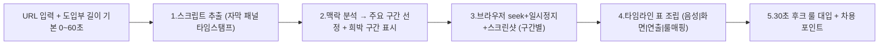

# 유튜브 도입부 분석 — 워크플로우 (SOP)

> 📌 **기준 문서 = [`작업지침서.md`](작업지침서.md)** — 키워드 선정·대본 원문·화면 캡처·001 서식·환경 제약까지 **모든 신규 자료가 따라야 할 마스터 SOP**입니다. 본 README는 도입부 분석 단계 설명이며, 전체 표준은 작업지침서를 우선합니다.

> **목적**: 레퍼런스 유튜브 영상의 **초반 30초~1분** 도입부를 해체·문서화한다.  
> 영상 전체를 보지 않고, **스크립트(자막) 기준 주요 구간** + **희박 구간 5~10초 샘플링**으로 화면을 캡처·분석한다.  
> 산출물은 우리 채널 후크 기획·촬영·편집의 레퍼런스로 사용한다.

---

## 1. 한 줄 정의

| 항목 | 내용 |
|---|---|
| **입력** | 유튜브 URL + 도입부 길이(기본 0~60초) |
| **방식** | 다운로드 없이 브라우저에서 스크립트 추출 → 맥락 분석 → 구간별 스크린샷 |
| **출력** | `분석.md` + `분석.html`(2탭 리포트) + `transcript.md` + `captures/*.png` |
| **실행(도구)** | [`실행_플레이북.md`](실행_플레이북.md) — Chrome 웹도구 호출에 매핑된 구체 절차 |
| **검증 기준** | [`_기준/30초_후크_룰_체크리스트.md`](_기준/30초_후크_룰_체크리스트.md) — 자체 포함(self-contained) |

---

## 2. 폴더 구조

```
20_research/competitors/도입부분석/
├── README.md                 ← 본 SOP (개요·규칙·단계 설명)
├── 실행_플레이북.md           ← 실제 실행 절차 (Chrome 웹도구 호출·JS 레시피)
├── _기준/                     ← 검증 기준 (자체 포함)
│   └── 30초_후크_룰_체크리스트.md
├── _TEMPLATE/                ← 복사용 템플릿 (분석 0건일 때 참조)
│   ├── 분석.md
│   ├── 분석.html            ← 표준 2탭 리포트 템플릿 (분석 리포트 + 대본 타임라인)
│   ├── transcript.md
│   └── captures/
└── <NNN>_<영상슬러그>/        ← 영상 1개당 1 폴더
    ├── 분석.md               ← 최종 타임라인 분석 (원본 데이터)
    ├── 분석.html             ← 2탭 리포트 (브라우저용) — 표준 산출물
    ├── transcript.md         ← 추출 원본 스크립트
    └── captures/             ← 구간별 스크린샷(+ _수동캡처_가이드.md)
        ├── 0000-0004_충격카드.png
        └── ...
```

> **읽는 순서**: 개념·규칙은 본 README → **실제 실행은 [`실행_플레이북.md`](실행_플레이북.md)** (도구 호출·JS 레시피·트러블슈팅) → 채점은 [`_기준/30초_후크_룰_체크리스트.md`](_기준/30초_후크_룰_체크리스트.md).

### 2-1. 폴더·파일명 규칙

| 규칙 | 예시 |
|---|---|
| 폴더명 | `001_유시민_책읽는방법` — 3자리 번호 + 슬러그(공백→`_`, 특수문자 제거) |
| 캡처 파일명 | `mmss-mmss_라벨.png` — 구간 시작·끝(분:초 4자리) + 한글 라벨 |
| 도입부 범위 | 기본 **0:00~1:00**. 쇼츠·1분 미만 영상은 전체. 필요 시 `0:00~0:30`으로 축소 가능 |

---

## 3. 워크플로우 (5단계)

> 아래는 **개념 설명**입니다. 각 단계의 **실제 도구 호출·JS 코드·트러블슈팅**은 [`실행_플레이북.md`](실행_플레이북.md)에 있습니다. 한 번에 돌리려면 플레이북 §8 마스터 프롬프트를 쓰세요.



---

### Step 1. 스크립트 추출 (YouTube 자막 패널)

**원칙**: 영상을 처음부터 끝까지 시청하지 않는다. 먼저 **타임스탬프가 붙은 스크립트**를 확보한다.

1. 브라우저에서 유튜브 영상 URL을 연다.
2. 영상 아래 **「…」→「스크립트 표시」**(또는 "Transcript")를 클릭한다.
3. 자막 언어가 한국어/영어 등 원하는 언어인지 확인한다.
4. **0:00 ~ 도입부 끝(기본 1:00)** 구간만 복사한다.
5. [`_TEMPLATE/transcript.md`](_TEMPLATE/transcript.md) 형식으로 `transcript.md`에 붙여넣는다.

**Claude Code 활용 예시 프롬프트**:

```
유튜브 URL: [URL]
도입부 0:00~1:00 구간의 스크립트를 YouTube 자막 패널에서 추출해
20_research/competitors/도입부분석/<폴더>/transcript.md 형식으로 정리해줘.
타임스탬프는 mm:ss 형식으로 유지.
```

**자막이 없는 영상**: Step 1을 건너뛰고 「확장 TODO §7」의 Whisper 대체 경로를 사용한다. (이번 SOP 범위 밖 — 다음 단계 스크립트화)

---

### Step 2. 맥락 분석 → 구간 선정

스크립트 전체를 읽고 **캡처할 구간**만 선정한다. 영상 전체 프레임을 캡처하지 않는다.

#### 2-1. 반드시 캡처할 구간 (주요 구간)

| # | 기준 | 설명 |
|---|---|---|
| 1 | **첫 컷** | 0:00 — 영상이 어떤 화면으로 시작하는지 |
| 2 | **첫 발화** | 스크립트 첫 문장이 나오는 시점 |
| 3 | **의미 전환** | 접속어·반전어("그런데", "하지만", "사실") 직전·직후 |
| 4 | **화면 전환** | 자막 카드 ↔ talking-head ↔ B-roll로 바뀌는 추정 시점 |
| 5 | **인물 등장** | 얼굴·손·책 등 주요 피사체가 처음 보이는 시점 |
| 6 | **숫자·키워드 강조** | "99%", "3가지" 등 후크 핵심 단어 발화 시점 |
| 7 | **도입부 마지막** | 0:55~1:00 — 본문으로 넘어가기 직전 화면 |

#### 2-2. 희박 구간 샘플링 (5~10초 규칙)

**희박 구간** = 스크립트상 **연속 발화가 없거나 5초 이상 공백**인 구간 (B-roll만 흐르거나, 음악·침묵·시각만 전달).

| 공백 길이 | 샘플링 간격 |
|---|---|
| 5~15초 | **5초**마다 1장 |
| 15초 이상 | **10초**마다 1장 |
| 3초 미만 | 샘플링 생략 (앞뒤 주요 구간 캡처로 충분) |

**예시**: 0:12~0:28 구간에 발화가 없고 B-roll만 있다면 → 0:12, 0:17, 0:22, 0:27 에 4장 캡처.

#### 2-3. 구간 선정 산출물

`transcript.md` 하단 **「§ 구간 선정표」**에 아래를 기록한다.

| 구간 | 유형 | 캡처 시점 | 라벨 |
|---|---|---|---|
| 0:00–0:04 | 주요 | 0:02 | 충격카드 |
| 0:12–0:28 | 희박(5초) | 0:12, 0:17, 0:22, 0:27 | 브롤_바다 |

---

### Step 3. 브라우저 캡처 (다운로드 없음)

**원칙**: 실제 YouTube 플레이어에서 해당 시점으로 이동 → 일시정지 → 스크린샷.

1. 브라우저에서 영상 URL을 연다 (Chrome·Edge 권장).
2. 플레이어 진행 바 또는 **타임스탬프 URL**로 이동한다.  
   - 예: `https://www.youtube.com/watch?v=VIDEO_ID&t=17s` → 0:17
3. **스페이스바** 또는 클릭으로 **일시정지**한다.
4. 플레이어 UI(재생 버튼·타임라인)가 보이면 **2~3초 후 UI가 사라질 때까지** 기다린 뒤 캡처한다.
5. 스크린샷을 `captures/`에 저장한다. 파일명 규칙: `mmss-mmss_라벨.png`

**캡처 팁**:

| 항목 | 권장 |
|---|---|
| 해상도 | 브라우저 창 1280px 이상 너비 (플레이어 720p 이상) |
| UI 제거 | 전체화면(F) 후 캡처, 또는 UI 사라진 순간 캡처 |
| 자막 | 플레이어 자막(CC) ON/OFF 각 1장 — 화면 자막 vs 플레이어 자막 구분용 |
| 중복 | 같은 구간 2장 이상 찍혀도 무방 — 분석.md 작성 시 1장만 링크 |

**Claude Code browser-use 활용 예시**:

```
유튜브 URL [URL]을 브라우저로 열고,
다음 시점에 seek 후 일시정지해서 스크린샷을 captures/ 폴더에 저장해줘:
- 0:02 (충격카드)
- 0:17 (브롤_바다)
- 0:35 (인물등장)
파일명: mmss-mmss_라벨.png 규칙 적용.
```

---

### Step 4. 타임라인 표 조립

[`_TEMPLATE/분석.md`](_TEMPLATE/분석.md)를 복사해 `분석.md`를 작성한다.

**타임라인 표 5열**:

| 열 | 내용 |
|---|---|
| **구간** | mm:ss–mm:ss |
| **음성(전사)** | transcript.md에서 해당 구간 발화 |
| **화면/컷** | talking-head / B-roll / 자막카드 / 풀스크린 이미지 / 슬라이드 |
| **시각 연출·자막** | 캡처 이미지 링크 + OCR·육안 관찰(색·폰트·전환·구도) |
| **후크 룰 매핑** | 30초 후크 룰 중 해당 항목 (예: "결론 먼저", "시각적 텐션") |

캡처 이미지는 상대 경로로 링크: ``

---

### Step 5. 30초 후크 룰 대입 + 차용 포인트

1. [`_기준/30초_후크_룰_체크리스트.md`](_기준/30초_후크_룰_체크리스트.md) 항목을 `분석.md` §3에 대입한다.
2. 레퍼런스 영상이 **충족/미충족/해당없음**을 표기한다.
3. **§4 차용 포인트**에 우리 채널(그럼에도 불구하고)에 적용 가능한 연출·문구 1~3개를 적는다.

**후크 유형 분류** (1줄 요약용):

- 충격 카드형 / 변화 약속형 / 자기 고백형 / 숫자 카드형 / 질문형 / 타 채널 클립 인용형 / 기타

---

## 4. 신규 분석 시작 체크리스트

- [ ] `20_research/competitors/도입부분석/<NNN>_<슬러그>/` 폴더 생성
- [ ] `_TEMPLATE/`에서 `분석.md`, `transcript.md` 복사
- [ ] `captures/` 빈 폴더 생성
- [ ] Step 1~5 순서대로 진행
- [ ] `분석.md` §1 한 줄 요약·§5 차용 포인트 작성 완료
- [ ] (선택) 해당 풀링/키 `정리본/`에 「도입부 레퍼런스」1행 링크 추가

---

## 5. 프로젝트 연계

| 문서 | 역할 | 위치 |
|---|---|---|
| [`_기준/30초_후크_룰_체크리스트.md`](_기준/30초_후크_룰_체크리스트.md) | 분석 결과 검증·대입 (**기본 사용**) | 자체 포함 |
| [`실행_플레이북.md`](실행_플레이북.md) | 도구 호출·실행 절차 | 자체 포함 |
| `_기획기준/대본기획_기준.md` | 후크 룰 맥락·8축/결 정식 정의 | 상위 폴더(있을 경우) |
| `풀링컨텐츠/…/06_뷰트랩_레퍼런스_리서치.md` | URL·활용 표 — 본 분석의 상세 확장판 | 상위 폴더(있을 경우) |
| `풀링컨텐츠/…/01_후크_제목_썸네일.md` 패턴 | 우리 영상 후크 기획 산출물 | 상위 폴더(있을 경우) |

> 8축·결의 **정식 정의**가 상위 `_기획기준/`에 있으면 [`_기준/30초_후크_룰_체크리스트.md`](_기준/30초_후크_룰_체크리스트.md) §4-A·§4-B 슬롯에 옮겨 채우세요. 없어도 추정 기본값으로 분석은 가능합니다.

**사용 흐름**: 뷰트랩·레퍼런스 리서치에서 URL 선정 → 본 SOP로 도입부 해체 → `01_후크_미리보기` 작성 시 차용.

---

## 6. 저작권·주의

- 타인 유튜브 영상·캡처는 **내부 기획·학습 참고용**으로만 사용한다.
- 캡처 이미지 **재업로드·상업적 2차 배포 금지**.
- `분석.md` 헤더에 **출처 URL·채널명·분석일**을 반드시 기록한다.
- 스크립트 추출도 동일 — 공개 자막 기반이며, 원문 전체 재게시 목적이 아님.

---

## 7. 한계·확장 TODO

| 한계 | 대응 |
|---|---|
| 자막 없는 영상 | Whisper 전사 대체 — [`transcribe_all.py`](../../../대본/키컨텐츠/이북리더기_자기계발/음성자료/transcribe_all.py) 패턴 확장 (다음 단계) |
| 캡처 **파일 자동 저장 불가** (검증됨) | 이 환경은 base64 반환 차단·`save_to_disk` 무효·sandbox YouTube 403 → **수동 캡처**(`Win+Shift+S`)로 저장. 상세 [`실행_플레이북.md`](실행_플레이북.md) §4-4·§9 |
| 브라우저 캡처 수동·느림 | (자동 저장이 열린 환경에서만) yt-dlp+ffmpeg 또는 캔버스 base64 — 본 환경은 둘 다 불가 |
| 화면 전환 시점 추정 | 스크립트만으로는 컷 전환을 100% 알 수 없음 → 희박 구간 5~10초 샘플링으로 보완 |
| 의미·연출 해석 | AI 보조 + 사람 1회 검수 권장 |

**다음 단계 (스크립트화 범위 밖)**:

1. `analyze_intro.py` — URL 입력 → transcript 정리 → 구간 선정표 초안 생성
2. yt-dlp `--download-sections "*0-60"` + ffmpeg `-ss` 프레임 캡처 (브라우저 폴백)
3. `bpt-master-planner` 카테고리 레지스트리에 「도입부분석」 라우팅 추가

---

## 변경 이력

| 날짜 | 변경 |
|---|---|
| 2026-06-07 | 최초 작성 — SOP·템플릿·폴더 규칙 정의 |
| 2026-06-07 | 고도화 — `실행_플레이북.md`(웹도구 매핑)·`_기준/`(자체 체크리스트) 추가, 참조 링크 자체화 |
